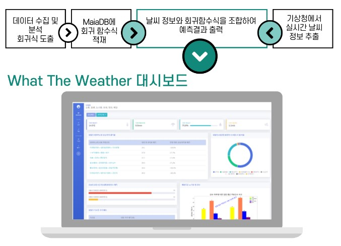
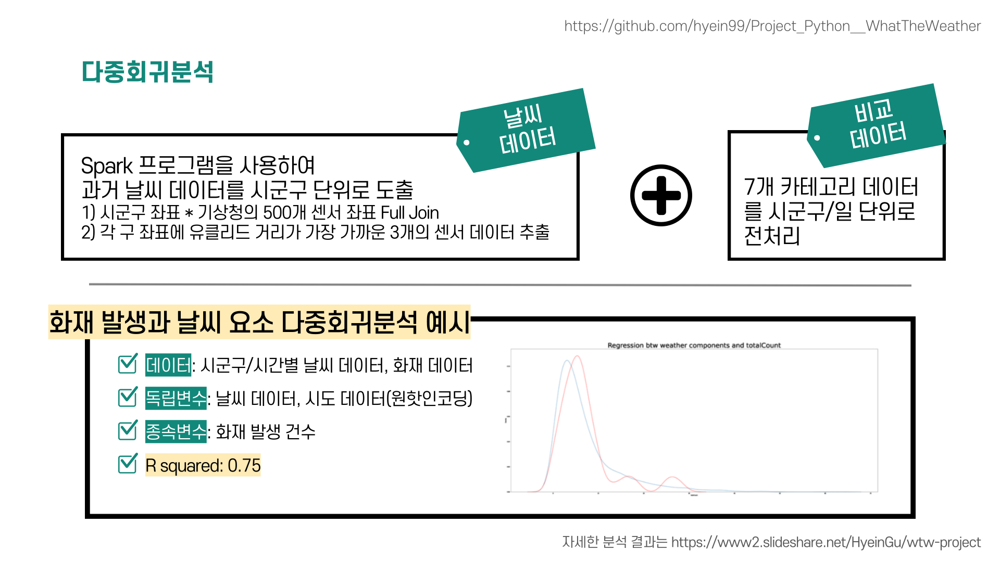

# What The Weather(WTW) Project
* presentation: https://www.slideshare.net/HyeinGu/wtw-project

## 1. 기획 의도
* 'What The Weather'는 날씨로 인해 달라지는 행동과 소비 패턴을 분석하는 프로젝트 입니다. 사람들의 일상을 나타낼 수 있는 카테고리를 [쇼핑, 질병, 배달, 영화, 화재발생, 교통사고, 식품산업] 7가지로 설정하여, 날씨와 생활정보를 분석하는 서비스 대시보드를 개발하였습니다.

## 2. 대시보드

## 3. 사용 Tool
* Python
* Spark
* django
* HTML, CSS, Javascript
* MariaDB, HeidiSQL
* Jupyter Notebook
* AWS EC2
* Github

## 4. Data
* 기상청
    * 시도/시군구별, 일/시간별 온도, 습도, 강우량, 일조량(2017~2020)
    * 수집 방법: CSV + 추가작업
* 네이버 쇼핑
    * 일별 2500개 상품 카테고리별 클릭율(2018~2020)
    * 수집 방법: 웹 크롤링
* 질병관리청 감염병 포털
    * 일별 질병 발병건수(2017.11~2020.10)
    * 수집 방법: 웹 크롤링
* KT빅데이터 플랫폼
    * 일별, 업종별 평균 주문 건수(2019.07~2019.08)
    * 수집 방법: CSV
* 영화관 입장권 통합 전산망
    * 일별 iptv 영화 top 100 장르(2017~2020)
    * 수집 방법: 웹 크롤링
* 소방청 국가 화재정보센터
    * 화재 장소별, 원인별 화재 추세(2017~2020)
    * 수집 방법: CSV, 웹 크롤링
* TAAS 교통사고 분석 시스템
    * 일자별, 시도/시군구별 교통사고(2017~2019)
    * 수집 방법: CSV
* KAMIS 농산물 유통정보
    * 일별, 품목별 도소매 가격 정보(2019.11~2020.10)
    * 수집 방법: Open API
    
## 5. 프로젝트 과정
#### 1) 데이터 수집 및 전처리

#### 2) 분석 및 예측
